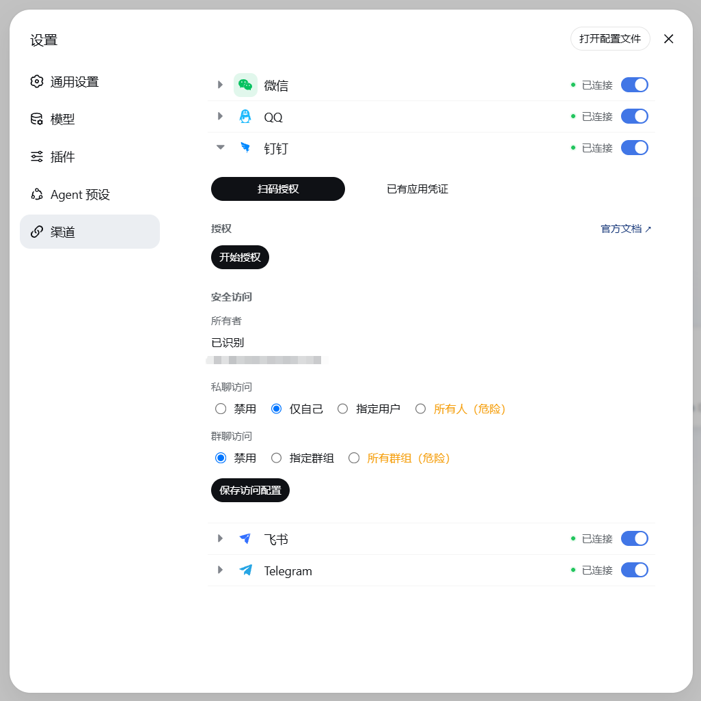
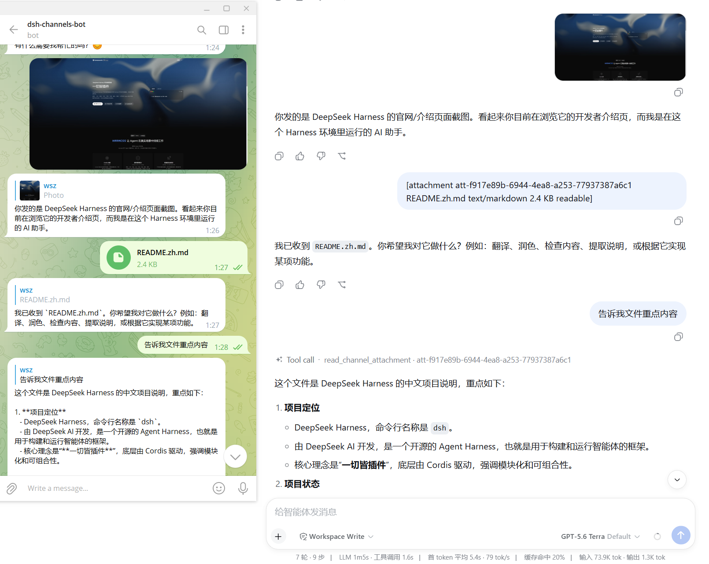
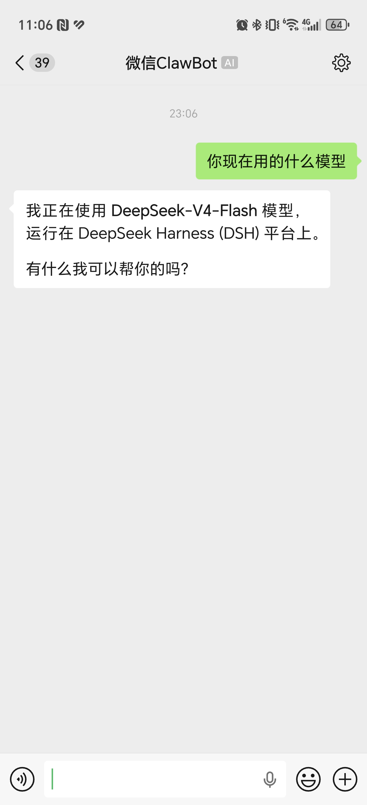
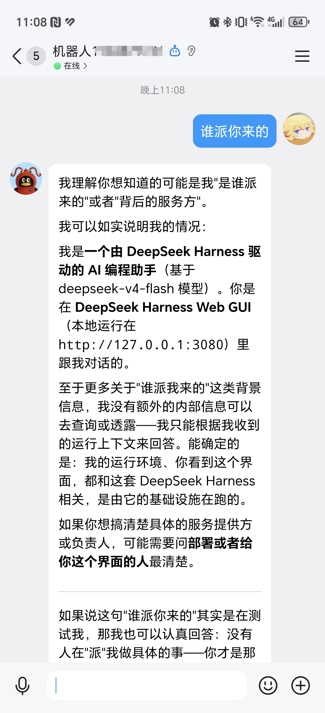
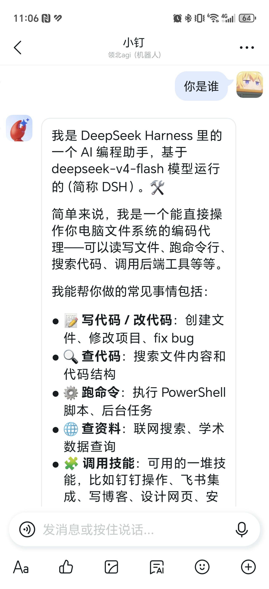
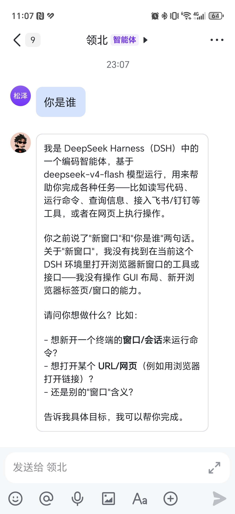

<div align="center">

# dsh-channels

Connect WeChat, QQ, DingTalk, Lark and Telegram to [DeepSeek Harness](https://github.com/deepseek-ai/deepseek-harness)

Multi-channel integration with unified configuration — chat with your Agent on every platform

Send and receive images and files, with PDF, DOCX, XLSX and text content readable by the Agent

[](https://github.com/wsz987/dsh-channels/actions/workflows/ci.yml)
[](https://www.npmjs.com/package/@wsz987/dsh-channels)
[](https://www.npmjs.com/package/@wsz987/dsh-channels)
[](https://github.com/wsz987/dsh-channels/stargazers)
[](LICENSE)
[](package.json)

English | [简体中文](README.md)

</div>

> This project adapts each platform's OpenClaw-oriented channel integration to DeepSeek Harness using the official SDKs / APIs. It does not depend on OpenClaw at runtime.
>
> Community project, not an official DeepSeek component.

## Preview

Once installed, configure and authorize channels via QR code in the Harness Web "Settings → Channels" panel, then chat with your Agent directly in each platform's conversation (screenshots from [docs/ScreenShot](./docs/ScreenShot)):

**Harness Web · Channels settings and Telegram integration example (image and file transfer, attachment reading)**

<p align="center">
  
  
</p>

**Platform conversations**

<p align="center">
  
  
  
  
</p>

## Capability matrix

| Channel | Text | Images | Files | Streaming | Status |
| --- | --- | --- | --- | --- | --- |
| WeChat | Yes | send/receive | inbound read | - | ✅ |
| QQ | Yes | send/receive | send/receive | Yes | ✅ |
| DingTalk | Yes | send/receive | send/receive | Yes | ✅ |
| Lark | Yes | send/receive | send/receive | Yes | ✅ |
| Telegram | Yes | send/receive | send/receive | Yes | ✅ |

- Vision-capable multimodal models can inspect images directly; PDF, DOCX, XLSX and text attachments can be extracted for the Agent to read (100 MiB inbound limit per file); audio and video are currently degraded.

## Before you start

- Confirm that `npx @deepseek-ai/dsh` runs and a normal Harness Web session can chat.
- Requires DeepSeek Harness `0.1.5-rc.2` and Node `22.19+` (see the [compatibility matrix](docs/compatibility-matrix.md)).
- Channel sessions normally use `Workspace Write`; enable `Full access` only when the task must access files outside the Workspace and you trust it.
- The project is evolving quickly; back up your data before upgrading.

## Installation

```bash
# Install the stable bundle
npx @deepseek-ai/dsh plugin --profile web add -w @wsz987/dsh-channels@latest

# Verify the bundle was merged into the profile
npx @deepseek-ai/dsh --profile web --dump-config

# Start Harness Web
npx @deepseek-ai/dsh web
```

After installation, configure or log in to the channels you need in Harness Web **Settings → Channels**, then complete the **Secure access** setup.

### Update and uninstall

Keep the `-w` flag when installing, updating and uninstalling. The bundle must match your Harness version, so **upgrade Harness first, then update the bundle**:

```bash
# Upgrade Harness (the current baseline is on npm's next tag)
npm i -g @deepseek-ai/dsh@next

# Update the bundle within the current release line
npx @deepseek-ai/dsh plugin --profile web update -w @wsz987/dsh-channels

# Crossing a release line: re-add it instead
npx @deepseek-ai/dsh plugin --profile web add -w @wsz987/dsh-channels@latest

# Uninstall
npx @deepseek-ai/dsh plugin --profile web remove -w @wsz987/dsh-channels
```

> See the [compatibility matrix](docs/compatibility-matrix.md) for the Harness version each bundle release needs.

## Configuration and login

| Channel | Required | Login |
| --- | --- | --- |
| WeChat | none | QR-code login; credentials auto-persist |
| QQ | AppID, AppSecret | Create a bot on the [QQ open platform](https://q.qq.com/qqbot/openclaw/) |
| DingTalk | clientId, clientSecret (optional) | Scan a QR code, or create an app on the [DingTalk open platform](https://open-dev.dingtalk.com/) |
| Lark | AppId, AppSecret | Create an app on the [Lark open platform](https://open.feishu.cn/app), or scan a QR code to create an agent |
| Telegram | Bot Token | Create a bot in [@BotFather](https://t.me/BotFather) and enter the token |

> **Telegram**: requires Bot API 10.2+; only `getUpdates` long polling is implemented, and startup calls `deleteWebhook`, removing any webhook already configured for that bot — do not let the same bot serve another webhook consumer.

### Required: configure secure access

Use **Settings → Channels → Secure access** to confirm who may use the local Agent through the bot. Everyone who can message the bot is **not** treated as authorized by default.

- **WeChat**: automatically uses the account from the current QR-code login.
- **DingTalk / Lark / Telegram**: select **Identify my account**, send the one-time identification command to the bot in a private chat, then confirm on the local page.
- **QQ**: private chats are limited to the bot creator, so no identification is needed; group access is configured separately.
- Group chats start disabled: add specific groups, or explicitly enable **All groups**.

Until this is confirmed, a channel may appear connected while messages never reach the Agent.

## Common operations

### Channel commands

In any channel conversation you can send slash commands, parsed and executed by Harness's official command system:

> Some commands are not currently available in group chats. Availability depends on the channel and conversation.

| Command | Description |
| --- | --- |
| `/stop` | Stop the current task immediately (highest priority: does not wait for queued channel messages; cancels the current agent directly) |
| `/new` | Start a fresh session (try it if you hit a bug) |
| `/help [command]` | List the commands active in the current session, or show one command's usage |
| `/status` | Show the current session / agent / model status |
| `/version` | Show the bundle version, Harness compatibility baseline and update hint |
| `/models [provider]` | List the model providers and their models registered in Harness |
| `/model [<provider> <model> [<reasoningEffort>]]` | Show or switch the current session's model |
| `/mirror [on\|off]` | Toggle mirror mode: when on, replies to turns you start in Web / CLI are also delivered to this conversation (off by default, persisted) |
| `/bind <session-id> [confirm]` | Rebind this conversation to an existing session (resolve first, then add `confirm` to apply) |

- `/help` lists every command available in the session (including commands from official plugins the host loads). An unrecognized slash command gets an "unknown command" reply and is never sent to the model.

#### `/model` examples

```text
/model                       # show the current model
/model deepseek deepseek-chat
/model openai gpt-5.6 high   # specify a reasoning effort
```

> `/model` also sets the global default model at the same time (visible in the Web UI / new sessions, no refresh needed).

### Workspace isolation

By default each channel / account pair is isolated automatically — no configuration needed. To reuse the Harness launch directory or disable isolation, edit `$DSH_HOME/profiles/web/cordis.patch.yml`:

```yaml
- id: channels-harness
  name: '@wsz987/dsh-channels/harness'
  inject: [channels, agents, agentDefaultModel, agentPresets, llm, commands]
  config:
    workspace:
      mode: channel-account # channel-account (default) | host-cwd | disabled
      autoCreate: true
```

## Roadmap

- Improve in-channel session management and error recovery.
- Support more IM channels (wishlist).

## Running from source

```bash
git clone https://github.com/wsz987/dsh-channels.git
cd dsh-channels
pnpm install
pnpm build
pnpm channels
pnpm web:debug
```

- `pnpm channels` can select channels, e.g. `pnpm channels weixin qq`.
- Rebuild and restart Harness after code changes; run `pnpm channels:clean` before switching back to the npm version.

Run the full gate before submitting:

```bash
pnpm ci:check
```

## 📚 Documentation

- [Architecture overview](docs/architecture.md)
- [Common/unified code design](docs/architecture/common-design.md)
- [Multi-channel planning](docs/architecture/channel-roadmap.md)
- [Architecture decision records (ADR)](docs/architecture/adr/)
- [Inbound access control (security)](docs/security/inbound-access-control.md)
- [Channel identity map (security)](docs/security/channel-identity-map.md)
- [Third-party adapter authoring guide](docs/adapter-authoring.md)
- [Release pipeline](docs/release.md)
- [Compatibility matrix (Harness / Node / required scenarios)](docs/compatibility-matrix.md)
- [Weixin live verification runbook](docs/weixin-live-verification-runbook.md)
- [Channel permission verification (APIs / scopes / upstream drift)](docs/channel-platform-verification.md)
- [Third-party notices](THIRD_PARTY_NOTICES.md)
- Per-package READMEs: `packages/*/README.md` (install / config / dev notes for each package)

---

## 🤝 Development guide

Follows the layering convention of mainstream open-source projects (Koishi / Wechaty style): **the adapter layer never touches core; core is unaware of platforms**.

### Repository structure

| Directory | Responsibility |
| --- | --- |
| `packages/channels` | Public bundle `@wsz987/dsh-channels` (aggregated patch) |
| `packages/channel-core` | **Channel Contract**: types + `ctx.channels` Service + `defineChannelAdapter` |
| `packages/channel-harness` | Channel ↔ Harness bridge; keeps only the optional `ChannelAttachmentProvider` port (`ChannelFileProvider` kept as a deprecated alias) |
| `packages/channel-files` | Generic attachment compatibility backend: session-scoped storage, legacy extraction, `read_channel_attachment` compatibility tool |
| `packages/channel-control` | Control plane: config / credentials / QR auth / runtime lifecycle |
| `packages/channel-{weixin,qq,dingtalk,lark,telegram}` | The five built-in channel adapters |
| `packages/channel-{compat,testkit,verify,web}` | Contract verification / test tooling / Web visualization |
| `templates/channel-adapter` | Scaffold for new channels |

### Using the core package (channel-core)

An adapter only implements the `ChannelAdapter` contract; core handles registration / mounting / receipt / health checks automatically:

```ts
import { defineChannelAdapter } from '@wsz987/channel-core';

export default defineChannelAdapter({
  id: 'my-channel',
  capabilities: {
    text: true, image: false, file: false,
    audio: false, video: false, markdown: false,
    cards: false, reactions: false, threads: false,
    streaming: 'buffered',   // native | edit | buffered
  },
  async start(ctx) { /* connect the platform, ctx.emit('message', ...) */ },
  async stop() { /* idempotent cleanup */ },
  async send(target, message) { /* send */ },
  // optional: createReply streaming / beginAuth+pollAuth QR / getHealth
});
```

Three red lines (see [docs/adapter-authoring.md](docs/adapter-authoring.md)):

1. **Never special-case a channel in core** — channel differences are negotiated by core via `capabilities`
2. Adapters must **not** call Harness Agent APIs (`ctx.agents...`)
3. Raw platform payloads must be mapped to structured `MessagePart` — never fed to the model directly

If the contract cannot express a need, report a contract gap — never modify channel-core / channel-harness.

### Adding a channel in four steps

1. Copy `templates/channel-adapter` to `packages/channel-<name>` and implement `defineChannelAdapter` (config / transport / mapper)
2. Add one line to `packages/channels/cordis.patch.yml` (`pnpm channels` auto-detects new channels)
3. `pnpm build && pnpm typecheck && pnpm test`
4. `pnpm verify packages/channel-<name> --test` to run contract verification (fixtures + manifest + test suite)

### Adding channel commands

Commands live as factories in `packages/channel-harness/src/commands/`; adding them to the `commandFactories` array registers them with the Agent automatically (official `@deepseek-ai/dsh-commands` format, no bridge changes needed):

```ts
// packages/channel-harness/src/commands/reset.ts
export function createResetCommand(deps: ChannelCommandDependencies): CommandDefinition {
  return {
    name: 'reset',
    description: 'Reset the current session',
    async handler(invocation) {
      if (invocation.rawInput.trim().length > 0) return { kind: 'error', text: 'Usage: /reset' };
      if (invocation.agent.status !== 'idle') return { kind: 'error', text: 'The current session is still running, please try again later.' };
      // ...call the bridge capability provided by deps
      return { kind: 'success', text: 'Session reset.' };
    },
  };
}
```

- `commandFactories` is the single registration point: `['createNewCommand', createResetCommand]`
- When a new bridge capability is needed, add a method (platform-agnostic) to `ChannelCommandDependencies` and implement it on the bridge side

### Commit and release

- **Commit**: Conventional Commits (`feat(scope): ...` / `fix(scope): ...` / `docs: ...`), scope is the package name (e.g. `channel-qq`)
- **PR**: pass CI (build + typecheck + test + contract verification + pre-live-gate checks)
- **Release**: record changes with `pnpm changeset` → `pnpm release` after CI merge (Changesets auto-publishes, see [docs/release.md](docs/release.md))

## 🙏 Acknowledgements

This project builds on the following open-source projects:

- [deepseek-ai/deepseek-harness](https://github.com/deepseek-ai/deepseek-harness) — DeepSeek Harness (`@deepseek-ai/*`)
- [DingTalk-Real-AI/dingtalk-openclaw-connector](https://github.com/DingTalk-Real-AI/dingtalk-openclaw-connector) — DingTalk channel plugin (`@dingtalk-real-ai/dingtalk-connector`)
- [tencent-connect/openclaw-qqbot](https://github.com/tencent-connect/openclaw-qqbot) — QQ bot channel plugin (`@tencent-connect/openclaw-qqbot`)
- [larksuite/openclaw-lark](https://github.com/larksuite/openclaw-lark) — Lark channel plugin (`@larksuite/openclaw-lark`)
- [Tencent/openclaw-weixin](https://github.com/Tencent/openclaw-weixin) — WeChat channel plugin (`@tencent-weixin/openclaw-weixin`)

## License

[MIT](LICENSE) © 2026 [wsz987](https://github.com/wsz987)
