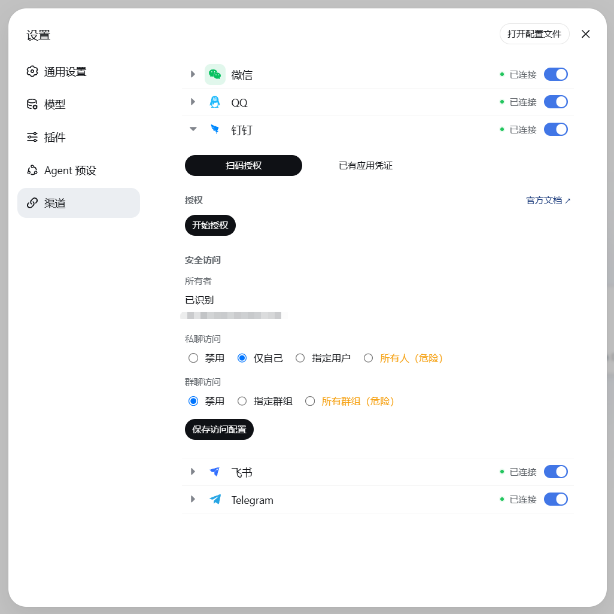
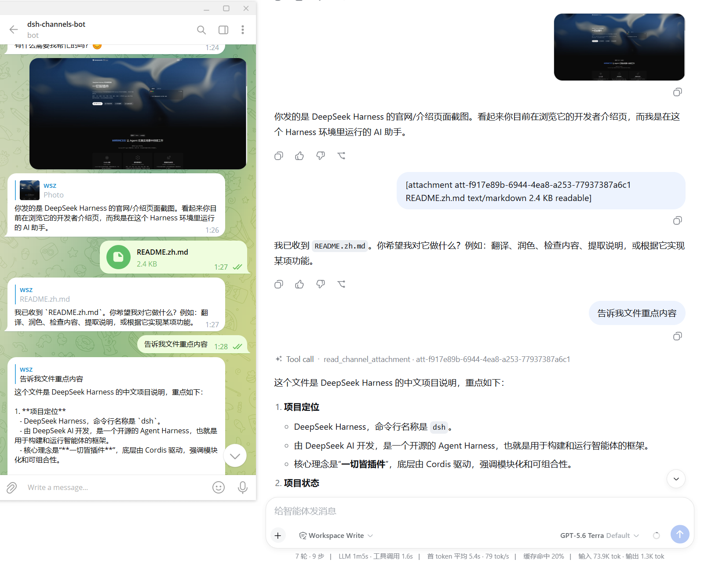
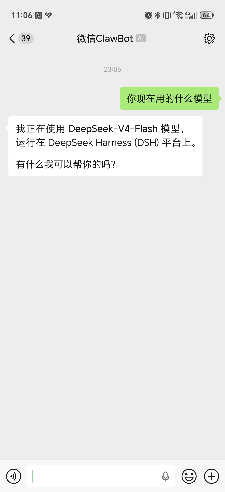
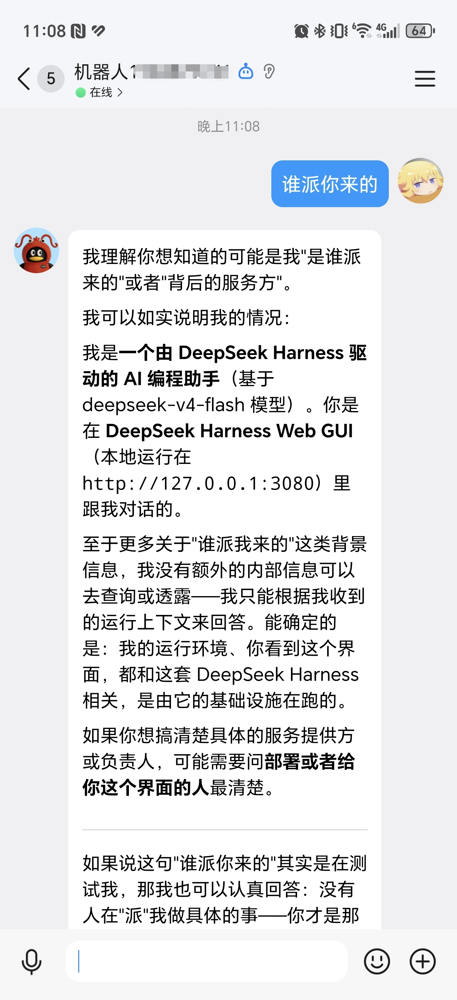
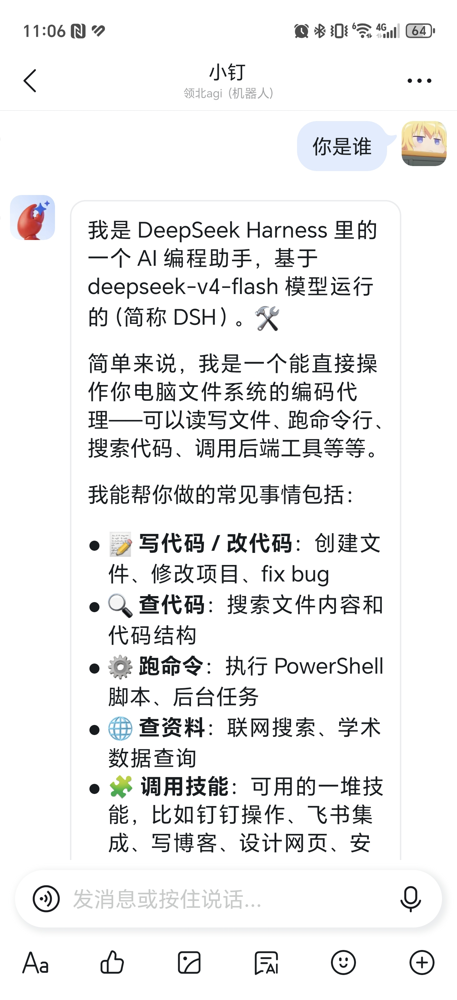
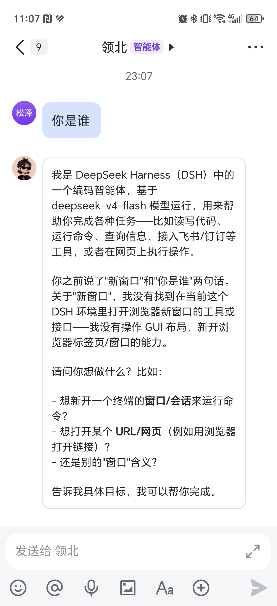

<div align="center">

# dsh-channels

将微信、QQ、钉钉、飞书和 Telegram 接入 [DeepSeek Harness](https://github.com/deepseek-ai/deepseek-harness)

多渠道集成，统一配置，并在各平台与 Agent 对话

支持图片与文件收发，Agent 可直接读取 PDF、DOCX、XLSX 和文本内容

[](https://github.com/wsz987/dsh-channels/actions/workflows/ci.yml)
[](https://www.npmjs.com/package/@wsz987/dsh-channels)
[](https://www.npmjs.com/package/@wsz987/dsh-channels)
[](https://github.com/wsz987/dsh-channels/stargazers)
[](LICENSE)
[](package.json)

[English](README.en.md) | 简体中文

</div>

> 本项目参考各平台面向 OpenClaw 提供的渠道接入方案，结合官方 SDK / API 适配到 DeepSeek Harness。运行时不依赖 OpenClaw。

## 效果预览

接入后，在 Harness Web“设置 → 渠道”面板统一配置与扫码授权，并在各平台对话框中直接与 Agent 对话（图片来源：[docs/ScreenShot](./docs/ScreenShot)）：

**Harness Web · 渠道设置与 Telegram 接入示例（图片与文件收发、附件内容读取）**

<p align="center">
  
  
</p>

**各平台对话框**

<p align="center">
  
  
  
  
</p>

## 能力总览

| 渠道 | 文本 | 图片 | 文件 | 流式回复 | 状态 |
| --- | --- | --- | --- | --- | --- |
| 微信 | 支持 | 收发 | 入站读取 | - | ✅ |
| QQ | 支持 | 收发 | 收发 | 支持 | ✅ |
| 钉钉 | 支持 | 收发 | 收发 | 支持 | ✅ |
| 飞书 | 支持 | 收发 | 收发 | 支持 | ✅ |
| Telegram | 支持 | 收发 | 收发 | 支持 | ✅ |

- 支持视觉的多模态模型可直接识别图片；PDF、DOCX、XLSX 和文本附件可提取内容供 Agent 读取（入站单文件上限 100 MiB）；音频和视频暂为降级处理。

## 使用前须知

- 确认 `npx @deepseek-ai/dsh` 可运行，且 Harness Web 普通会话可正常对话。
- 渠道会话通常使用 `Workspace Write`；仅在确需访问 Workspace 外文件且信任当前任务时启用 `Full access`。
- 项目仍在快速迭代，升级前请备份数据。

> **从 0.3.x 或更早版本升级？** 0.4.1 起收紧了渠道访问权限。升级后请前往 **Harness Web → 设置 → 渠道 → 选择已启用的渠道 → 安全访问**，重新确认允许使用 Bot 的账号和群聊。完成前，即使渠道显示连接正常，普通消息也可能无法进入 Agent。

## 安装

```bash
# 安装稳定版 bundle
npx @deepseek-ai/dsh plugin --profile web add -w @wsz987/dsh-channels@latest

# 检查 bundle 是否合并到 profile
npx @deepseek-ai/dsh --profile web --dump-config

# 启动 Harness Web
npx @deepseek-ai/dsh web
```

安装完成后，在 Harness Web 的“设置 → 渠道”中配置或登录需要使用的渠道，并完成“安全访问”设置。

### 更新与卸载

安装、更新和卸载时请保留 `-w` 参数。

```bash
# 在当前 package.json 版本范围内更新
npx @deepseek-ai/dsh plugin --profile web update -w @wsz987/dsh-channels

# 卸载 bundle
npx @deepseek-ai/dsh plugin --profile web remove -w @wsz987/dsh-channels
```

## 配置与登录

| 渠道 | 必要信息 | 登录方式 |
| --- | --- | --- |
| 微信 | 无 | 扫码登录，凭据自动持久化 |
| QQ | AppID、AppSecret | [QQ 开放平台](https://q.qq.com/qqbot/openclaw/)创建机器人 |
| 钉钉 | clientId、clientSecret（可选） | 扫码或在[钉钉开放平台](https://open-dev.dingtalk.com/)创建应用 |
| 飞书 | AppId、AppSecret | 在[飞书开放平台](https://open.feishu.cn/app)创建应用，或扫码创建智能体 |
| Telegram | Bot Token | 在 [@BotFather](https://t.me/BotFather) 创建机器人并填写 Token |

密钥由 Harness 凭据管理，`cordis.patch.yml` 只填写 `appSecretRef` 等引用。完整示例见 [minimal-profile](apps/example/minimal-profile/)；配置 patch 会整体替换 `config`，不会深度合并。

Telegram adapter 最低支持 Bot API 10.2；`formatting.mode: auto` 默认使用 Rich
Markdown。项目不维护旧 Bot API server 的自动兼容，`plain` 仅作为显式输出模式或
格式错误时的单次降级。

### 必做：配置安全访问

首次安装或从 0.3.x 升级后，需要在“安全访问”中确认谁可以通过 Bot 使用本机 Agent。系统默认不会把“能给 Bot 发消息的人”自动视为已授权用户。

- 微信会根据当前扫码账号自动设置为“仅当前扫码微信账号”。
- 钉钉、飞书和 Telegram 请点击“识别我的账号”，按页面提示私聊 Bot 发送一次识别指令，然后回到本地页面确认检测到的账号。
- QQ 私聊由平台限制为创建者可用，不显示“识别我的账号”；群聊访问仍需在本地明确配置。
- 完成确认后，默认启用“仅自己使用”：只有已确认的账号可以通过私聊驱动 Agent，群聊默认关闭。

在账号尚未识别、访问配置缺失或配置无效时，渠道可以保持连接以完成账号识别，但普通消息和命令都会被安全阻止，不会进入 Agent、创建会话或执行 `/stop` 等操作。页面上预先选中的“仅自己使用”只是建议配置，必须先识别并确认所有者后才会生效。

除 QQ 外，私聊访问可分别选择“禁用”“仅自己”“指定用户”或“所有人（危险）”；QQ 私聊仅由平台允许创建者使用，不显示本地私聊访问配置。群聊访问单独选择“指定群组”并填写 Group ID，或选择“所有群组（危险）”并配置统一的群成员规则。“私聊所有人”不会自动开放任何群聊。微信当前仅支持私聊，不显示群聊配置。

## 常用操作

### 渠道指令

任意渠道会话内可直接发斜杠指令，由 Harness 官方命令系统解析执行：

> 部分指令暂不支持在群聊中使用，具体可用范围以当前渠道和会话为准。

| 指令 | 说明 |
| --- | --- |
| `/stop` | 立即终止当前任务（最高优先级：不等渠道排队消息，直接取消当前 Agent） |
| `/new` | 开启全新会话（遇到 bug 可以尝试使用） |
| `/help [command]` | 查看当前会话实际生效的命令，或单个命令的用法 |
| `/status` | 查看当前 Session / Agent / 模型状态 |
| `/models [provider]` | 查看 Harness 当前注册的模型 Provider 及其模型 |
| `/model [<provider> <model> [<reasoningEffort>]]` | 查看或切换当前会话模型 |

- 若宿主加载了官方插件（`/compact`、`/goal`、`/plan`、`/feedback` 等），这些命令也会自动出现在渠道里，无需额外升级。
- **未注册的斜杠指令不再被拦截**：会原样作为普通用户输入交给模型处理。

#### `/model` 示例

```text
/model                       # 查看当前会话解析到的模型
/model deepseek deepseek-chat
/model openai gpt-5.6 high   # 指定 reasoning effort
```

> `/model` 切换当前会话，并同步写入 Harness 的全局默认模型，供后续新会话使用。

### 主动外发

在渠道会话中让 Agent 调用 `send_channel_message`，可以主动向当前渠道发送文本、图片或支持的文件。Harness Web 直接创建的普通会话没有渠道绑定，不能执行渠道外发。

### Workspace 隔离

默认按“渠道 / 账号”创建独立 Workspace，路径为 `<dsh-home>/workspaces/channels/<channel>/<account>`，无需额外配置。

如需复用 Harness 启动目录或关闭隔离，可在 profile patch 中覆盖 `channels-harness`：

```yaml
- id: channels-harness
  name: '@wsz987/dsh-channels/harness'
  inject: [channels, agents, agentDefaultModel, agentPresets, llm, commands, apiProxy]
  config:
    workspace:
      mode: channel-account # channel-account（默认）| host-cwd | disabled
      autoCreate: true
```

> Harness patch 会整体替换目标插件配置，并非局部合并；覆盖时请保留该插件需要的完整字段。

### 关闭不需要的渠道

在 profile patch 中将对应渠道插件的 `enabled` 设为 `false`，或删除可选的 `channels-files` 行以关闭通用文件扩展。

## 已知限制

| 当前限制 | 临时处理方式 | 后续方向 |
| --- | --- | --- |
| 渠道内没有权限切换指令 | 在 Harness Web 中调整未来新会话的默认权限，或修改对应会话的 Access 设置 | 完善渠道内的会话管理能力 |

该限制是当前渠道交互层尚未接入对应能力，不代表 Harness 不支持。相关上游能力可查阅 [Harness Reference](https://deepseek-harness.github.io/deepseek-harness/reference/)。

## Roadmap

- 完善渠道内的会话管理和异常恢复体验。
- 接入更多即时通讯渠道（画饼中）。

## 从源码运行

```bash
git clone https://github.com/wsz987/dsh-channels.git
cd dsh-channels
pnpm install
pnpm build
pnpm channels
pnpm web:debug
```

- `pnpm channels` 可指定渠道，例如 `pnpm channels weixin qq`。
- 修改代码后重新构建并重启 Harness；切回 npm 版本前运行 `pnpm channels:clean`。

提交前运行完整门禁：

```bash
pnpm ci:check
```

## 📚 文档

- [架构总览](docs/architecture.md)
- [公共/统一代码设计](docs/architecture/common-design.md)
- [多渠道规划](docs/architecture/channel-roadmap.md)
- [架构决策记录（ADR）](docs/architecture/adr/)
- [入站访问控制（安全）](docs/security/inbound-access-control.md)
- [渠道身份映射（安全）](docs/security/channel-identity-map.md)
- [第三方渠道接入指南](docs/adapter-authoring.md)
- [发布流程](docs/release.md)
- [微信 live 验证手册](docs/weixin-live-verification-runbook.md)
- [渠道权限核验（接口/权限/上游漂移对照）](docs/channel-platform-verification.md)
- [第三方版权声明](THIRD_PARTY_NOTICES.md)
- 各子包 README：`packages/*/README.md`（每个包的安装、配置、开发说明）

---

## 🤝 二次开发规范

参考主流开源项目（Koishi / Wechaty 风格）的分层约定：**适配器层零侵入核心，核心层不感知平台**。

### 仓库结构

| 目录 | 职责 |
| --- | --- |
| `packages/channels` | 对外 bundle `@wsz987/dsh-channels`（聚合 patch） |
| `packages/channel-core` | **Channel Contract**：类型 + `ctx.channels` Service + `defineChannelAdapter` |
| `packages/channel-harness` | 渠道 ↔ Harness 桥；只保留可选 `ChannelFileProvider` 端口 |
| `packages/channel-files` | 可选通用文件扩展：私有存储、成熟文档解析库、读取工具 |
| `packages/channel-control` | 控制面：配置 / 凭据 / 扫码授权 / 运行时生命周期 |
| `packages/channel-{weixin,qq,dingtalk,lark,telegram}` | 五个内置渠道适配器 |
| `packages/channel-{compat,testkit,verify,web}` | 契约验证 / 测试工具 / Web 可视化 |
| `templates/channel-adapter` | 新渠道脚手架 |

### 使用核心包（channel-core）

适配器只需实现 `ChannelAdapter` 契约，核心自动完成注册 / 挂载 / 回执 / 健康检查：

```ts
import { defineChannelAdapter } from '@wsz987/channel-core';

export default defineChannelAdapter({
  id: 'my-channel',
  capabilities: {
    text: true, image: false, file: false,
    audio: false, video: false, markdown: false,
    cards: false, reactions: false, threads: false,
    streaming: 'buffered',   // native | edit | buffered
  },
  async start(ctx) { /* 连接平台、ctx.emit('message', ...) */ },
  async stop() { /* 幂等清理 */ },
  async send(target, message) { /* 发送 */ },
  // 可选：createReply 流式 / beginAuth+pollAuth 扫码 / getHealth 健康
});
```

三条红线（详见 [docs/adapter-authoring.md](docs/adapter-authoring.md)）：

1. **不在 core 里按渠道做特判**——渠道差异由 core 按 `capabilities` 协商处理
2. 适配器**禁止**调用 Harness Agent API（`ctx.agents...`）
3. 平台原始 payload 必须映射为结构化 `MessagePart`，**禁止**直塞给模型

契约表达不了的需求 → 上报 contract gap，**禁止**改 channel-core / channel-harness。

### 新增渠道四步

1. 复制 `templates/channel-adapter` 为 `packages/channel-<name>`，实现 `defineChannelAdapter`（含 config / transport / mapper）
2. 在 `packages/channels/cordis.patch.yml` 加一行（`pnpm channels` 自动识别新渠道）
3. `pnpm build && pnpm typecheck && pnpm test`
4. `pnpm verify packages/channel-<name> --test` 跑契约验证（fixtures + manifest + 测试套件）

### 新增渠道指令

指令以 factory 形式放在 `packages/channel-harness/src/commands/`，加入 `commandFactories` 数组即随 Agent 自动注册（官方 `@deepseek-ai/dsh-commands` 格式，无需改 bridge）：

```ts
// packages/channel-harness/src/commands/reset.ts
export function createResetCommand(deps: ChannelCommandDependencies): CommandDefinition {
  return {
    name: 'reset',
    description: 'Reset the current session',
    async handler(invocation) {
      if (invocation.rawInput.trim().length > 0) return { kind: 'error', text: '用法：/reset' };
      if (invocation.agent.status !== 'idle') return { kind: 'error', text: '当前会话仍在运行，请稍后再试。' };
      // ...调用 deps 提供的 bridge 能力
      return { kind: 'success', text: '已重置会话。' };
    },
  };
}
```

- `commandFactories` 是唯一注册点：`['createNewCommand', createResetCommand]`
- 需要 bridge 新能力时，在 `ChannelCommandDependencies` 加一个方法（平台无关），bridge 侧实现即可

### 提交与发布

- **Commit**：Conventional Commits（`feat(scope): ...` / `fix(scope): ...` / `docs: ...`），scope 用包名（如 `channel-qq`）
- **PR**：过 CI（build + typecheck + test + 契约验证 + live gate 前检）
- **发布**：`pnpm changeset` 记录变更 → CI 合入后 `pnpm release`（Changesets 自动发版，见 [docs/release.md](docs/release.md)）

## 🙏 致谢

本项目基于以下开源项目：

- [deepseek-ai/deepseek-harness](https://github.com/deepseek-ai/deepseek-harness) —— DeepSeek Harness（`@deepseek-ai/*`）
- [DingTalk-Real-AI/dingtalk-openclaw-connector](https://github.com/DingTalk-Real-AI/dingtalk-openclaw-connector) —— 钉钉渠道插件（`@dingtalk-real-ai/dingtalk-connector`）
- [tencent-connect/openclaw-qqbot](https://github.com/tencent-connect/openclaw-qqbot) —— QQ 机器人渠道插件（`@tencent-connect/openclaw-qqbot`）
- [larksuite/openclaw-lark](https://github.com/larksuite/openclaw-lark) —— 飞书渠道插件（`@larksuite/openclaw-lark`）
- [Tencent/openclaw-weixin](https://github.com/Tencent/openclaw-weixin) —— 微信渠道插件（`@tencent-weixin/openclaw-weixin`）

## License

[MIT](LICENSE) © 2026 [wsz987](https://github.com/wsz987)
