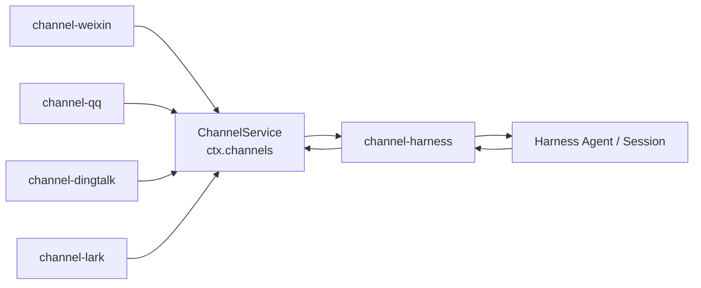
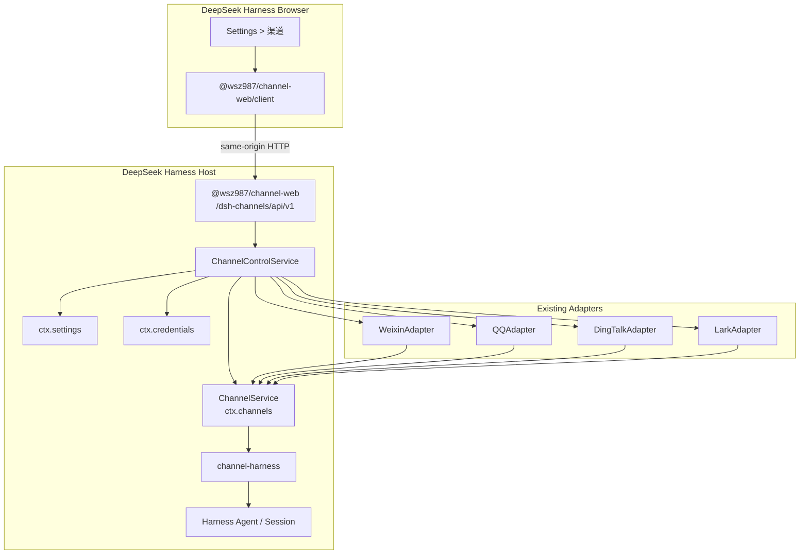
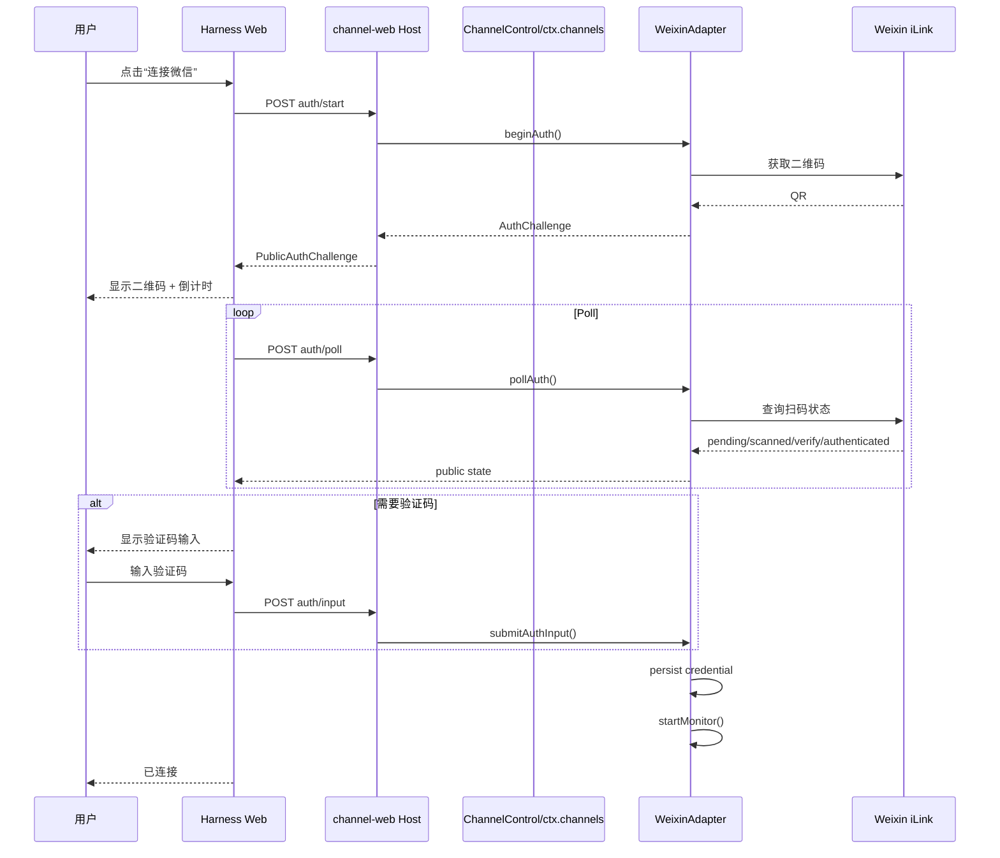

# dsh-channels：DeepSeek Harness Web 可视化接入实施执行计划

> **文档性质**：实施规格 / Execution Plan  
> **目标项目**：`wsz987/dsh-channels`  
> **dsh-channels 基线**：`0c75dddebe8e899d6d55d45be3b827b033860b01`（2026-08-14）  
> **DeepSeek Harness 基线**：`47f943859bef60e4160492346772ded9b24f765a` / `dsh 0.1.0-rc.5`（2026-08-13）  
> **参考项目**：`wsz987/openclaw-toolkit` —— **仅复用扫码/授权交互经验，不复用其 Tauri/Rust 架构。**
---

# ⚡ 执行状态（2026-08-15，会话内更新）

## M0 — Harness Web 插件兼容性 Spike：✅ 通过

外部包 @wsz987/channel-web 已作为真实 Harness Web client plugin 被官方 rc.6 加载：

- [x] dump-config 出现 channels-web（@wsz987/channel-web）
- [x] window.__DSH_BOOT__ 含 @wsz987/channel-web（inject: dsh-client-runtime / dsh-client-locale / dsh-client-ui-settings）
- [x] GET /plugins/@wsz987/channel-web/client.js?rev=… → 200，格式为 window.__ModuleLoader__.load({id, factory})
- [x] Client fiber ACTIVE（Settings 导航出现「渠道」，页面渲染，零 page error）
- [x] 单元测试：channel-web 4/4、dsh-channels bundle 13/13、turbo 全量 13/13

实现产物：packages/channel-web（host tsc + client esbuild bundle）、bundle patch 追加 channels-web row、
packages/channels/package.json 依赖 @wsz987/channel-web。

## M1 — Read-only Dashboard + 微信扫码：✅ 代码与自动化验证通过（真实扫码留待手工 Gate）

- [x] Web 展示四渠道（weixin/qq/dingtalk/lark 四卡；裸 profile 下仅 weixin mount，其余显示 offline view，符合 ChannelView 模型）
- [x] 当前 Adapter 健康状态来自真实 getHealth
- [x] Host API：GET /channels、GET /channels/:id、POST /channels/:id/auth/start|poll|input（/dsh-channels/api/v1）
- [x] 安全边界：mutating 仅 loopback、JSON content-type、64 KiB body、严格 schema、challenge 仅存 host、错误净化（真实响应已验证无 payload/secret）
- [x] 微信真实二维码：live iLink 实测返回 https://liteapp.weixin.qq.com/q/…（URL 形态）→ 对话框渲染「打开微信授权链接」；上游返回 data:image 时渲染 （两种形态均处理）
- [x] 倒计时 / 过期遮罩 / 重新生成 / 验证码输入 / 成功失败状态（QrAuthDialog）
- [x] Core 通用 AuthInput + submitAuthInput?（channel-core），WeixinAdapter 映射 verification-code → submitVerifyCode
- [x] 无真实扫码 CI；单元测试：channel-web 44/44、channel-core 30/30、channel-weixin 53+4、bundle 13/13、turbo 全量 22/22
- [ ] 真实扫码 + 手机收发 E2E：留待手工 Gate（§22 流程）

> 遗留说明：真实 profile 已加 @wsz987/channel-web link 依赖与 junction；下次 dsh web 重启后
> Settings > 渠道 即在真实 GUI 出现。QQ 在无凭据 profile 下按设计不 mount（启动要求 credential）；
> DingTalk/Lark 在裸 profile 下 start 失败属既有行为，M2 managed lifecycle 阶段统一处理。


---

# 0. 执行摘要

本次不是重做 `dsh-channels`，而是在**现有 Runtime 架构旁边增加一个 Harness Web 管理面**。

现有消息链路保持不动：

```text
平台 SDK / 协议
      ↓
channel-weixin / channel-qq / channel-dingtalk / channel-lark
      ↓
ChannelService（ctx.channels）
      ↓
channel-harness
      ↓
Harness Agent / Session
      ↓
ReplyRouter
      ↓
原 Channel Adapter
      ↓
平台
```

新增的只是控制链路：

```text
DeepSeek Harness Web
      ↓
Settings > 渠道
      ↓
@wsz987/channel-web/client
      ↓
/dsh-channels/api/v1/*
      ↓
@wsz987/channel-web（Host）
      ↓
ChannelControlService
      ↓
ctx.channels + ctx.settings + ctx.credentials
      ↓
现有四个 Adapter
```

因此本方案的核心原则是：

1. **不改 `channel-harness` 的 Agent/Session 语义。**
2. **不把平台 SDK / 协议代码搬进 Web。**
3. **Web 只负责“查看 / 配置 / 授权 / 启停”。**
4. **运行态仍然由现有 `ChannelAdapter` 和 `ChannelService` 承担。**
5. **安装继续使用 DeepSeek Harness 官方 Bundle/Profile 机制。**
6. **Web 页面使用 Harness 官方 `dsh.client + settings.section` 扩展机制。**
7. **V1 不把外部仓库强行塞进 Harness 内部 Typert 生成链；管理 API 使用官方 `ctx.webServer.register()`。**
8. **微信真实扫码手工验收，不进入 CI。**

---

# 1. 为什么这样接入：以 Harness 官方开发机制为准

## 1.1 Bundle 安装机制

`@wsz987/dsh-channels` 当前已经是正确的 DSH Bundle：

```json
{
  "dsh": {
    "bundle": {
      "patch": "./cordis.patch.yml"
    }
  }
}
```

官方的安装路径就是：

```bash
npx @deepseek-ai/dsh plugin --profile web add @wsz987/dsh-channels
npx @deepseek-ai/dsh --profile web --dump-config
npx @deepseek-ai/dsh web
```

首次执行 `dsh plugin --profile web add ...` 会自动初始化 profile。

因此：

**不要新增自己的 profile 管理系统，不要手工修改 `$DSH_HOME/profiles/web/package.json`。**

---

## 1.2 Harness Web Client Plugin

Harness Web 不要求 fork 前端。

一个已挂载的 Host package，只要：

```json
{
  "exports": {
    "./client": {
      "default": "./lib/client.js"
    }
  },
  "dsh": {
    "client": {
      "platform": "web"
    }
  }
}
```

Host 的 Client Module 系统就会把它扫描进：

```text
window.__DSH_BOOT__
```

并从：

```text
/plugins/<package-id>/client.js
```

加载浏览器插件。

所以 `dsh-channels` 的 GUI 应当是一个真正的 Harness Client Plugin，而不是另起一个 Web 管理后台。

---

## 1.3 Settings 官方扩展点

Harness Settings 明确声明：

```text
settings.section
```

是“一个功能拥有一整页设置界面”的官方 slot。

因此 UI 的正确位置为：

```text
DeepSeek Harness
└─ Settings
   ├─ General
   ├─ Models
   ├─ Plugins
   ├─ ...
   └─ 渠道
      ├─ 微信
      ├─ QQ
      ├─ 钉钉
      └─ 飞书
```

Client 插件采用与官方 `ui-settings-general` 同样的注册方式：

```ts
ctx.slots.inject('settings.section', () =>
  ctx.slots.register(
    {
      name: 'settings.section',
      id: 'channels',
      order: 60,
      label: () => t('nav'),
      locale: 'channels',
    },
    ChannelsSection,
  ),
)
```

> `order: 60` 是本项目的建议值，不当作 Harness 的稳定 ABI；M0 集成测试确认实际导航位置后固定。

---

## 1.4 为什么不塞进 Harness 自带“插件配置”

当前 Harness 的通用 Plugin Configuration 页面存在一个明确限制：

```text
Web 可访问的 settings namespace
由 Host apiproxy 白名单决定
```

也就是说，外部分发的 npm 插件不能只靠自己声明 namespace，就自动进入官方“插件配置”卡片。

所以本项目应：

```text
❌ 不使用 Settings > Plugins > Configurable 作为主入口
✅ 自己贡献 Settings > 渠道 页面
```

这是官方扩展模型允许的，而且更适合二维码、连接状态、验证码、外部开发者平台链接等非普通表单交互。

---

# 2. 当前 dsh-channels 架构：哪些必须保持

当前 `packages/channels/cordis.patch.yml` 负责组合：

```text
channels-service
channels-harness
channels-weixin
channels-qq
channels-dingtalk
channels-lark
```

核心已经形成清晰边界：



必须继续满足：

### Red Line A — `channel-core` 不知道平台 SDK

`ChannelService` 只负责：

```text
registry
events
shared secrets/storage
adapter context
```

继续保持。

### Red Line B — 只有 `channel-harness` 触碰 Harness Agent / Session

Web 管理包：

```text
不允许 import Harness Agent
不允许自行创建 Session
不允许自行 followup
不允许处理 assistant/chunk
```

所有消息仍经过原来的 `channel-harness`。

### Red Line C — Web 不直接操作 SDK

错误：

```text
ChannelsSection.tsx
  ↓
import @larksuiteoapi/node-sdk
```

正确：

```text
ChannelsSection.tsx
  ↓ HTTP
ChannelControlService
  ↓
LarkAdapter
  ↓
Lark upstream driver
```

---

# 3. 推荐新增结构

新增两个 package：

```text
packages/
├─ channel-core/             # 已有，不改变职责
├─ channel-harness/          # 已有，不改变职责
├─ channel-weixin/           # 已有
├─ channel-qq/               # 已有
├─ channel-dingtalk/         # 已有
├─ channel-lark/             # 已有
│
├─ channel-control/          # NEW：渠道管理/动态生命周期
│  ├─ src/index.ts
│  ├─ src/service.ts
│  ├─ src/types.ts
│  ├─ src/config.ts
│  ├─ src/auth.ts
│  ├─ src/definitions/
│  │  ├─ weixin.ts
│  │  ├─ qq.ts
│  │  ├─ dingtalk.ts
│  │  └─ lark.ts
│  └─ test/
│     ├─ service.test.ts
│     ├─ lifecycle.test.ts
│     ├─ config.test.ts
│     └─ redaction.test.ts
│
├─ channel-web/              # NEW：Harness Host + Browser 双面插件
│  ├─ package.json
│  ├─ tsconfig.json
│  ├─ tsdown.config.ts
│  ├─ src/index.ts           # Host entry
│  ├─ src/protocol.ts        # client-safe DTO
│  ├─ src/host/
│  │  ├─ routes.ts
│  │  ├─ router.ts
│  │  ├─ security.ts
│  │  └─ json.ts
│  ├─ src/client/
│  │  ├─ index.ts
│  │  ├─ ChannelsSection.tsx
│  │  ├─ api.ts
│  │  ├─ locales.ts
│  │  ├─ hooks/
│  │  │  ├─ use-channel-list.ts
│  │  │  └─ use-auth-session.ts
│  │  └─ components/
│  │     ├─ ChannelCard.tsx
│  │     ├─ ChannelStatusBadge.tsx
│  │     ├─ QrAuthDialog.tsx
│  │     ├─ SecretField.tsx
│  │     ├─ WeixinSetup.tsx
│  │     ├─ QqSetup.tsx
│  │     ├─ DingTalkSetup.tsx
│  │     └─ LarkSetup.tsx
│  └─ test/
│     ├─ routes.test.ts
│     ├─ security.test.ts
│     ├─ protocol.test.ts
│     └─ client-registration.test.ts
│
└─ channels/                 # 已有 Bundle，继续只做 composition
```

### 为什么拆 `channel-control`

`channel-web` 不应该成为 Adapter 生命周期所有者。

正确职责：

```text
channel-web
= Harness Web 运输 + 页面

channel-control
= 配置 + 凭据引用 + Adapter 生命周期控制

channel-core
= 稳定 Channel Contract + Registry

channel-harness
= Agent/Session Bridge
```

这样以后即使增加 CLI/TUI 管理界面，也可以直接复用：

```text
ChannelControlService
```

而不是复用 React 页面。

---

# 4. 最终运行架构



注意：

```text
Web 控制面
与
消息数据面
是两条不同路径
```

Web 页面挂掉，不影响已经运行的：

```text
手机 → Adapter → Harness → Adapter → 手机
```

---

# 5. ChannelControlService 设计

## 5.1 Service API

新增：

```ts
export class ChannelControlService extends Service {
  list(): Promise<ChannelView[]>

  get(id: ManagedChannelId): Promise<ChannelView>

  updateConfig(
    id: ManagedChannelId,
    patch: ChannelConfigPatch,
  ): Promise<ChannelView>

  setEnabled(
    id: ManagedChannelId,
    enabled: boolean,
  ): Promise<ChannelView>

  restart(id: ManagedChannelId): Promise<ChannelView>

  beginAuth(id: ManagedChannelId): Promise<PublicAuthChallenge>

  pollAuth(
    id: ManagedChannelId,
    challengeId: string,
  ): Promise<PublicAuthPoll>

  submitAuthInput(
    id: ManagedChannelId,
    challengeId: string,
    input: AuthInput,
  ): Promise<PublicAuthPoll>

  disconnect(id: ManagedChannelId): Promise<ChannelView>
}
```

Cordis：

```ts
super(ctx, 'channelControl')
```

并补：

```ts
declare module '@deepseek-ai/cordis' {
  interface Context {
    channelControl: ChannelControlService
  }
}
```

---

## 5.2 ChannelView

浏览器只拿“公开投影”：

```ts
export type ManagedChannelId =
  | 'weixin'
  | 'qq'
  | 'dingtalk'
  | 'lark'

export interface ChannelView {
  id: ManagedChannelId
  enabled: boolean
  configured: boolean
  mounted: boolean

  status:
    | 'disabled'
    | 'unconfigured'
    | 'starting'
    | 'authorizing'
    | 'connected'
    | 'degraded'
    | 'error'

  health?: {
    status: 'ok' | 'degraded' | 'down'
    connection?: string
    authenticated?: boolean
    detail?: string
  }

  setup: {
    mode: 'qr' | 'credentials' | 'hybrid'
    fields: ChannelPublicField[]
  }

  lastError?: string
}
```

严禁返回：

```text
Weixin token
QQ AppSecret
DingTalk AppSecret
Lark AppSecret
raw AuthChallenge.payload
SDK client object
raw upstream response
```

---

# 6. Adapter 生命周期管理

## 6.1 当前问题

目前每个 Adapter 是由 Cordis row 直接：

```text
apply(ctx, config)
→ new Adapter
→ mountChannelAdapter()
```

这非常适合静态 profile 配置。

但 GUI 保存以后，如果希望：

```text
不重启整个 npx @deepseek-ai/dsh web
```

就必须允许单个 Adapter：

```text
stop old
→ construct new
→ register
→ start
```

因此 Web 管理版本需要一个稳定的运行态 Owner。

---

## 6.2 Managed Adapter Handle

在 `channel-control` 内部维护：

```ts
interface ManagedAdapterHandle {
  id: ManagedChannelId
  adapter: ChannelAdapter
  abort: AbortController
  unregister: () => void
}
```

生命周期必须严格：

```text
create
  ↓
ctx.channels.register(adapter)
  ↓
adapter.start(createAdapterContext)
  ↓
ACTIVE
```

重配：

```text
old abort
  ↓
old adapter.stop()
  ↓
old unregister()
  ↓
create new adapter
  ↓
register
  ↓
start
```

失败时：

```text
new start failed
  ↓
abort new
  ↓
best-effort stop
  ↓
unregister new
  ↓
ChannelView.status = error
```

**不要同时保留旧 Adapter 和新 Adapter。**

因为当前 `AdapterRegistry` 对相同 `id` 会 fail loud。

---

# 7. Bundle 组合迁移

## 7.1 M0–M1：先不动现有四个 Adapter row

第一阶段只新增：

```yaml
- id: channels-web
  name: '@wsz987/channel-web'
```

此时 Web 只做：

```text
read-only status
+ 微信 beginAuth / pollAuth
```

直接通过现有：

```text
ctx.channels.get('weixin')
```

工作。

这样可以先证明：

```text
Harness Web 插件真正能加载
Settings 真正能出现
微信 QR 真正能显示
```

而不同时引入生命周期重构。

---

## 7.2 M2：切换 Managed Mode

M2 完成 `channel-control` 后，Bundle 从：

```text
channels-weixin
channels-qq
channels-dingtalk
channels-lark
```

直接生命周期，切到：

```text
channels-control
```

统一生命周期。

目标 patch：

```yaml
- insert:
    - id: channels-service
      name: '@wsz987/channel-core/plugin'

    - id: channels-harness
      name: '@wsz987/channel-harness'
      inject:
        - channels
        - agents

    - id: channels-control
      name: '@wsz987/channel-control'
      inject:
        - channels
        - settings
        - credentials

    - id: channels-web
      name: '@wsz987/channel-web'
      inject:
        - channels
        - channelControl
```

`channel-web` **不要在 Loader row 上硬注入 `webServer`**。

Host entry 内部：

```ts
export function apply(ctx: Context): void {
  ctx.inject(['webServer'], (webCtx) => {
    webCtx.effect(() =>
      webCtx.webServer.register({
        kind: 'prefix',
        path: '/dsh-channels/api/v1',
        handler: createChannelWebHandler(webCtx),
      }),
    )
  })
}
```

这样：

```text
安装到 web profile → 有 webServer → 出现 HTTP 控制面
安装到非 Web profile → 没有 webServer → 页面控制面不激活
```

不会破坏其它 Harness profile。

---

## 7.3 兼容策略

由于当前 `@wsz987/dsh-channels` 已经是 `0.9.0`，建议：

```text
0.9.x
= 当前 direct adapter composition

1.0.0
= managed composition + Harness Web
```

发布 1.0 前提供迁移说明：

旧的 profile override：

```yaml
- id: channels-qq
  config:
    ...
```

不再作为 Web-managed 配置真源。

新配置落在：

```text
$DSH_HOME/settings.yaml
```

的 dsh-channels namespaces 中。

不要尝试通过未公开 Loader 内部 API 偷读旧 entry config。

---

# 8. Harness Settings 持久化设计

Harness base bundle 已经默认提供：

```text
ctx.settings
ctx.credentials
```

所以 `channel-control` 应直接复用。

建议 namespace：

```text
dsh-channels.weixin
dsh-channels.qq
dsh-channels.dingtalk
dsh-channels.lark
```

例如：

```yaml
dsh-channels.weixin:
  enabled: true
  accountId: main

dsh-channels.qq:
  enabled: false
  accountId: main
  appId: "..."
  appSecretRef: DSH_CHANNEL_QQ_MAIN_SECRET

dsh-channels.dingtalk:
  enabled: false
  upstream:
    mode: sdk
    clientId: "..."
    clientSecretRef: DSH_CHANNEL_DINGTALK_MAIN_SECRET

dsh-channels.lark:
  enabled: false
  upstream:
    mode: sdk
    appId: "..."
    appSecretRef: DSH_CHANNEL_LARK_MAIN_SECRET
    domain: feishu
```

用户保存：

```text
Web
 ↓
ChannelControlService.updateConfig
 ↓
ctx.settings.mutate/update
 ↓
settings.yaml
 ↓
restart(channelId)
```

不要让浏览器直接调用 Harness 通用 settings namespace wire。

这是因为当前 Harness Browser settings allowlist 不允许外部插件自行暴露 namespace。

---

# 9. Secret 必须先统一

## 9.1 QQ：保持现在正确设计

现有 QQ 已经：

```text
config:
  appId
  appSecretRef

real AppSecret:
  ctx.credentials
```

保持。

---

## 9.2 DingTalk：M3 必须改

当前：

```ts
upstream.clientSecret?: string
```

在做可视化配置前改为：

```ts
upstream.clientSecretRef?: string
```

插件启动：

```ts
const credential =
  await ctx.credentials.resolve(
    credentialRef(config.upstream.clientSecretRef),
  )
```

然后才构造 Adapter。

浏览器只能收到：

```json
{
  "clientSecretConfigured": true
}
```

不能收到真实 Secret。

---

## 9.3 Lark：M3 必须改

当前：

```ts
upstream.appSecret?: string
```

改：

```ts
upstream.appSecretRef?: string
```

同样由：

```text
ctx.credentials
```

解析。

`appId` 本身不是密码，可保留在 settings。

---

## 9.4 微信

微信扫码后 token 已经由：

```text
AccountCredentialStore
→ ChannelService shared secret/storage
```

保存。

V1 不需要把微信凭据迁去 `ctx.credentials`。

保持已有稳定路径。

---

# 10. Auth Contract 补齐

当前 Core 已经有：

```ts
beginAuth?()
pollAuth?()
```

以及：

```ts
AuthChallenge {
  id
  instruction
  qrUrl?
  expiresAt?
}
```

这已经非常适合 Web。

但是微信还有：

```ts
submitVerifyCode(code)
```

它目前是 WeixinAdapter 特有方法。

Web 层不能：

```ts
(adapter as WeixinAdapter).submitVerifyCode(...)
```

否则 Web 管理面开始依赖具体平台实现。

---

## 10.1 Core 新增通用 Auth Input

建议：

```ts
export type AuthInput = {
  kind: 'verification-code'
  value: string
}

export interface AuthPrompt {
  kind: 'verification-code'
  label: string
  message?: string
}

export interface AuthStatePoll {
  state: Exclude<AuthState, 'unknown'>
  detail?: string
  prompt?: AuthPrompt
}

export interface ChannelAdapter {
  ...
  beginAuth?(): Promise<AuthChallenge>
  pollAuth?(challenge: AuthChallenge): Promise<AuthStatePoll>

  submitAuthInput?(
    challenge: AuthChallenge,
    input: AuthInput,
  ): Promise<void> | void
}
```

Weixin 映射：

```ts
submitAuthInput(_challenge, input) {
  if (input.kind === 'verification-code') {
    this.qrAuth!.submitVerifyCode(input.value)
  }
}
```

这样 Web 页面完全平台无关。

---

# 11. Web Host API

## 11.1 路径

不要占 Harness 自己的：

```text
/api/*
/plugins/*
```

使用：

```text
/dsh-channels/api/v1
```

---

## 11.2 V1 路由

```text
GET  /dsh-channels/api/v1/channels
GET  /dsh-channels/api/v1/channels/:id

POST /dsh-channels/api/v1/channels/:id/config
POST /dsh-channels/api/v1/channels/:id/enabled
POST /dsh-channels/api/v1/channels/:id/restart

POST /dsh-channels/api/v1/channels/:id/auth/start
POST /dsh-channels/api/v1/channels/:id/auth/poll
POST /dsh-channels/api/v1/channels/:id/auth/input

POST /dsh-channels/api/v1/channels/:id/disconnect
```

一个 prefix handler 自己做 path dispatch 即可。

不要给每个按钮注册一条 WebServer route。

---

# 12. Web API 安全边界

这里不能直接照搬 Harness `/api` 的 trust fence，因为我们使用的是独立 route。

因此 V1 必须主动加最小安全边界。

## 12.1 Mutating API 只允许 loopback

允许：

```text
127.0.0.1
::1
::ffff:127.0.0.1
```

其它地址：

```text
403
```

特别是用户用：

```bash
npx @deepseek-ai/dsh web --host 0.0.0.0
```

时，不允许 LAN 浏览器修改渠道凭据和扫码状态。

---

## 12.2 POST 只接受 JSON

要求：

```http
Content-Type: application/json
```

否则：

```text
415
```

---

## 12.3 Body 限制

建议：

```text
64 KiB
```

超过：

```text
413
```

渠道配置根本不应该上传大对象。

---

## 12.4 严格 schema

所有请求：

```text
parse
→ schema validation
→ domain call
```

不要：

```ts
const body = JSON.parse(...)
await control.updateConfig(id, body as any)
```

---

## 12.5 Challenge 只在 Host 保存

Host：

```ts
Map<challengeId, {
  channelId
  challenge
  expiresAt
}>
```

浏览器只拿：

```ts
PublicAuthChallenge {
  id
  instruction
  qrUrl?
  expiresAt?
}
```

`payload` 不过 wire。

---

# 13. Browser package

## 13.1 package.json

目标形态：

```json
{
  "name": "@wsz987/channel-web",
  "type": "module",
  "main": "./lib/index.js",
  "types": "./lib/types/index.d.ts",
  "exports": {
    ".": {
      "types": "./lib/types/index.d.ts",
      "default": "./lib/index.js"
    },
    "./client": {
      "types": "./lib/types/client/index.d.ts",
      "default": "./lib/client.js"
    },
    "./protocol": {
      "types": "./lib/types/protocol.d.ts",
      "default": "./lib/protocol.js"
    }
  },
  "dsh": {
    "client": {
      "platform": "web",
      "inject": [
        "@deepseek-ai/dsh-client-ui-settings",
        "@deepseek-ai/dsh-client-locale"
      ]
    }
  }
}
```

---

## 13.2 Harness Client bundle 兼容性

这是本项目必须先做的 **M0 Spike**。

Harness 当前自己的 `clientBundle()` 会产出：

```text
lib/client.js
```

并包装：

```js
window.__ModuleLoader__.load({
  id: '@wsz987/channel-web',
  factory: (require) => {
    ...
    return module.exports
  }
})
```

外部项目不能假定 Harness 仓库内部：

```text
packages/client/tsdown.client.ts
```

是稳定、可直接 import 的公共 npm API。

因此在本仓库内建立：

```text
packages/channel-web/tsdown.config.ts
```

做一层 **rc.5-compatible adapter**。

客户端 runtime external 至少对齐当前 Harness platform table：

```text
react
react/jsx-runtime
react-dom
react-dom/client
@deepseek-ai/cordis
@deepseek-ai/dsh-client-ui-slots
@deepseek-ai/dsh-client-web-react
@deepseek-ai/dsh-client-ui-primitives
@deepseek-ai/dsh-client-ui-attachment
@deepseek-ai/dsh-client-schema-form
```

M0 的目的不是写漂亮页面，而是证明：

```text
外部 npm package
→ dsh.client 扫描
→ __DSH_BOOT__
→ /plugins/@wsz987/channel-web/client.js
→ Cordis Client fiber ACTIVE
→ settings.section 成功注册
```

这一步不通过，不进入后续 UI 开发。

---

# 14. Browser apply()

客户端必须遵守 Harness 插件之间的依赖原则：

```text
plugin ↔ plugin
通过 Cordis service / slots 协作
```

不要在 runtime value 层直接 import 另一个 UI plugin。

示例：

```ts
import type { ClientContext } from '@deepseek-ai/dsh-client-runtime/client'
import type {} from '@deepseek-ai/dsh-client-ui-settings/client'
import type {} from '@deepseek-ai/dsh-client-locale/client'

export const inject = ['slots', 'locale']

export function apply(ctx: ClientContext): void {
  ctx.effect(
    () => ctx.locale.register('channels', { zh, en }),
    'channel-web: locales',
  )

  const t = ctx.locale.bind('channels')

  ctx.slots.inject('settings.section', () =>
    ctx.slots.register(
      {
        name: 'settings.section',
        id: 'channels',
        order: 60,
        label: () => t('nav'),
        locale: 'channels',
      },
      ChannelsSection,
    ),
  )
}
```

---

# 15. 页面设计

## 15.1 总览

```text
┌─────────────────────────────────────────────────────────────┐
│ 渠道                                                        │
│ 将 DeepSeek Harness 接入手机聊天平台                         │
│                                                             │
│ ┌───────────────┐  ┌───────────────┐                       │
│ │ 微信           │  │ QQ            │                       │
│ │ ● 已连接       │  │ ○ 未配置      │                       │
│ │ main           │  │ main          │                       │
│ │               │  │               │                       │
│ │ [管理]         │  │ [开始配置]    │                       │
│ └───────────────┘  └───────────────┘                       │
│                                                             │
│ ┌───────────────┐  ┌───────────────┐                       │
│ │ 钉钉           │  │ 飞书           │                       │
│ │ ○ 未配置       │  │ △ 连接异常     │                       │
│ │               │  │               │                       │
│ │ [开始配置]     │  │ [检查配置]     │                       │
│ └───────────────┘  └───────────────┘                       │
└─────────────────────────────────────────────────────────────┘
```

普通用户只看到：

```text
状态
账号
连接/配置
重新绑定
停用
```

默认不显示：

```text
manifest
testedVersion
cursor
dedup key
gateway sequence
run_id
SDK transport
```

---

# 16. 微信：第一条真正打通的可视化链路

当前 `WeixinAdapter` 已经具备：

```text
无 credential 启动
→ disconnected
→ beginAuth()
→ pollAuth()
→ persist credential
→ startMonitor()
→ connected
```

所以微信是最适合 M1 打通的渠道。



### M1 UI 要有

```text
二维码
倒计时
二维码过期遮罩
重新生成
等待扫码
手机已扫码/等待确认
验证码输入
成功
失败
```

这些交互可参考 `openclaw-toolkit` 已经验证过的 QR Dialog。

但通信从：

```text
Tauri invoke()
```

改为：

```text
fetch('/dsh-channels/api/v1/...')
```

---

# 17. QQ 页面

QQ 的真实流程必须保持准确：

```text
扫码登录 QQ 开放平台
≠
自动创建 QQ Bot
```

页面推荐向导：

```text
Step 1
QQ 扫码登录开放平台

Step 2
打开 QQ 开放平台机器人管理

Step 3
创建/选择机器人

Step 4
填写 AppID

Step 5
填写 AppSecret
→ 写 ctx.credentials
→ settings 只写 appSecretRef

Step 6
启动 QQAdapter

Step 7
getHealth / Ready
```

最终用户感受仍然可以是：

```text
“一路引导完成”
```

但不能伪装成：

```text
“一扫即自动拿到机器人凭据”
```

---

# 18. 钉钉 / 飞书页面

## 钉钉

建议先把“机器人运行凭据”与“授权辅助二维码”分开表示：

```text
AppKey / Client ID
AppSecret
连接模式
SDK / Gateway
[保存并连接]
```

如果提供 Device Flow QR：

```text
作为授权辅助入口
```

不要把它描述为必然替代机器人 AppKey/AppSecret。

---

## 飞书 / Lark

同理：

```text
Domain: 飞书 / Lark
App ID
App Secret
连接模式
SDK / Gateway
[保存并连接]
```

再提供：

```text
扫码授权
```

作为可选辅助流程。

---

# 19. openclaw-toolkit 到底复用什么

本项目只迁移这些“交互经验”：

```text
use-qr-code-display
QR → data URL
倒计时
过期遮罩
点击刷新
loading/polling/error 状态
打开授权链接
验证码状态
QQ 扫码后的下一步引导
```

明确不迁移：

```text
Tauri command
Rust backend
OpenClaw config writer
OpenClaw runtime lifecycle
desktop installation model
```

映射关系：

```text
openclaw-toolkit
React → Tauri invoke → Rust

dsh-channels
React → channel-web HTTP → ChannelControlService
```

---

# 20. M0–M5 实施计划

# M0 — Harness Web 插件兼容性 Spike

### 目标

只证明：

```text
外部 @wsz987/channel-web
可以被官方 Harness rc.5 正常加载
```

### Task 0.1

创建：

```text
packages/channel-web
```

只实现一个：

```text
Settings > 渠道
```

页面文字：

```text
dsh-channels web extension loaded
```

### Task 0.2

完成外部 client bundle 构建：

```text
lib/index.js
lib/client.js
lib/client.js.map
lib/types/...
```

### Task 0.3

修改 Bundle patch：

```yaml
- id: channels-web
  name: '@wsz987/channel-web'
```

### Task 0.4

本地 pack：

```bash
pnpm build
pnpm --filter @wsz987/channel-web pack
pnpm --filter @wsz987/dsh-channels pack
```

### Task 0.5

干净 Harness profile：

```bash
npx @deepseek-ai/dsh plugin --profile web add <dsh-channels-tarball>
npx @deepseek-ai/dsh --profile web --dump-config
npx @deepseek-ai/dsh web
```

### M0 验收

必须同时满足：

```text
[PASS] dump-config 出现 channels-web
[PASS] window.__DSH_BOOT__ 有 @wsz987/channel-web
[PASS] /plugins/@wsz987/channel-web/client.js 200
[PASS] Client fiber ACTIVE
[PASS] Settings 导航出现“渠道”
[PASS] 卸载插件后页面消失
[PASS] 再安装不会出现重复 slot
```

**M0 不通过，禁止进入扫码功能。**

---

# M1 — Read-only Dashboard + 微信扫码

### 不改

```text
现有 4 个 Adapter Cordis rows
```

### 新增

Host API：

```text
GET channels
GET channel/:id
POST weixin/auth/start
POST weixin/auth/poll
POST weixin/auth/input
```

### 数据来源

```ts
ctx.channels.list()
adapter.getHealth?.()
adapter.beginAuth?.()
adapter.pollAuth?.()
```

### UI

四张卡。

微信按钮真正可扫码。

其它三张卡可先显示：

```text
当前状态
当前 capabilities
“配置界面将在下一阶段开放”
```

### M1 验收

```text
[PASS] Web 展示四渠道
[PASS] 当前 Adapter 健康状态来自真实 getHealth
[PASS] 微信二维码可显示
[PASS] 过期可刷新
[PASS] 验证码可提交
[PASS] 扫码成功后显示 connected
[PASS] 手机发微信 → Harness 回答 → 微信收到回复
[PASS] 无真实扫码 CI
```

---

# M2 — ChannelControlService + 动态生命周期

### Task 2.1

创建：

```text
packages/channel-control
```

### Task 2.2

注册四个 Settings namespace。

### Task 2.3

实现：

```text
start(id)
stop(id)
restart(id)
setEnabled(id)
updateConfig(id)
```

### Task 2.4

每个操作加 mutex / serialized queue：

```text
同一 channelId
不允许并发 restart
```

最低要求：

```ts
Map<channelId, Promise<void>>
```

链式排队。

### Task 2.5

完成 direct mode → managed mode bundle 切换。

### M2 验收

```text
[PASS] 修改一个渠道配置不需重启 Harness
[PASS] 只重启该 Adapter
[PASS] 另三个 Adapter 不受影响
[PASS] restart 过程中 registry 不出现 duplicate
[PASS] start 失败无半挂载 Adapter
[PASS] Harness restart 后 settings 自动恢复
```

---

# M3 — Secret 统一 + QQ

### Task 3.1

DingTalk：

```text
clientSecret → clientSecretRef
```

### Task 3.2

Lark：

```text
appSecret → appSecretRef
```

### Task 3.3

Web Secret API 写：

```text
ctx.credentials
```

### Task 3.4

实现 QQ Setup Wizard。

### M3 验收

```text
[PASS] 浏览器 response 无任何真实 secret
[PASS] settings.yaml 无真实 secret
[PASS] 日志无 secret
[PASS] QQ 保存配置后可动态启动
[PASS] AppSecret 更新无需改 profile
```

---

# M4 — 钉钉 / 飞书完整 UI

实现：

```text
DingTalkSetup
LarkSetup
```

包括：

```text
credential form
domain/mode
health
save
restart
disable
optional QR helper
```

### M4 验收

```text
[PASS] 配置可持久化
[PASS] 凭据引用正确
[PASS] 连接错误可读
[PASS] 单渠道重启
[PASS] disable 后资源释放
```

---

# M5 — 发布体验

### 安装文档

官方标准方式：

```bash
npx @deepseek-ai/dsh plugin --profile web add @wsz987/dsh-channels
npx @deepseek-ai/dsh --profile web --dump-config
npx @deepseek-ai/dsh web
```

### 可选便利 CLI

后续可以提供：

```bash
npx @wsz987/dsh-channels install
```

但内部只能包装：

```bash
npx @deepseek-ai/dsh plugin --profile web add @wsz987/dsh-channels
```

不能维护第二套 profile 系统。

### M5 验收

```text
[PASS] npm 包预构建 lib
[PASS] 用户安装不需要本地 TypeScript build
[PASS] package 包含 client.js
[PASS] 清洁机器安装可进入 Settings > 渠道
```

---

# 21. CI 计划

新增常规 CI：

```text
channel-control unit
channel-web host route
channel-web protocol
channel-web security
channel-web client registration
pack artifact verification
```

## 必须覆盖

### Control

```text
start rollback
stop disposer
restart
duplicate prevention
settings restore
credential missing
health projection
```

### HTTP

```text
method not allowed
content-type
invalid JSON
body too large
unknown channel
invalid DTO
loopback allowed
LAN denied
secret redaction
expired auth challenge
```

### Client

```text
settings.section registration
unmount unregister
locale registration
QR countdown
poll cancellation
dialog close cancels timer
```

### Artifact

CI 解包 tarball：

```text
package.json
cordis.patch.yml
lib/index.js
lib/client.js
lib/client.js.map
```

必须都存在。

---

# 22. 手工真实平台 Gate

不要再让真实微信扫码成为普通 CI 的先决条件。

发布前单独执行：

```text
Weixin Manual Live Gate
```

流程：

```text
npx @deepseek-ai/dsh web
→ Settings
→ 渠道
→ 微信
→ 连接微信
→ 扫码
→ authenticated
→ 手机发送“你好”
→ Harness 建立/恢复 Session
→ Agent 回复
→ 微信收到
→ 重启 npx @deepseek-ai/dsh web
→ 不重新扫码
→ 再次收发成功
```

这个 Gate 才验证：

```text
Web UI
+ QR Auth
+ credential persistence
+ Adapter monitor
+ channel-harness
+ Harness Agent
+ reply routing
```

完整闭环。

---

# 23. 失败与状态模型

UI 不应该从 error string 猜状态。

Host 统一：

```ts
type ChannelRuntimeStatus =
  | 'disabled'
  | 'unconfigured'
  | 'starting'
  | 'authorizing'
  | 'connected'
  | 'degraded'
  | 'error'
```

对应 UI：

```text
disabled      灰色  已停用
unconfigured  灰色  未配置
starting      spinner 正在连接
authorizing   spinner 等待授权
connected     状态点 已连接
degraded      警告  连接异常
error         错误  配置/启动失败
```

`lastError` 必须经过净化：

```text
允许：
"QQ credential is not configured"

禁止：
"QQ AppSecret abcdef.... failed"
```

---

# 24. 不做的东西

V1 明确不做：

```text
❌ fork DeepSeek Harness
❌ 修改 Harness Settings shell
❌ 修改 Harness api-proxy allowlist
❌ 把渠道页面塞进通用 Plugin Config
❌ Web 直接调用平台 SDK
❌ 重写 channel-harness
❌ Web 自己创建 Agent / Session
❌ CI 自动微信扫码
❌ 为了 GUI 把 Channel Core 变成平台-aware
```

另外：

```text
Typert Remote
```

暂时不作为 V1 前置依赖。

原因：

Harness 当前 Typert Client Remote 的生成和 Client assembly 选择机制主要由 Harness 自己的 build graph 管理。

等官方对“独立外部 npm 插件 Remote contribution”形成稳定公开开发路径后，可以 M6 再把：

```text
/dsh-channels/api/v1
```

迁到：

```text
ctx.remote.channels.*
```

但不应该因此阻塞现在的 Web 可视化。

---

# 25. 最终目录变化

```text
dsh-channels/
├─ packages/
│  ├─ channel-core/
│  │  └─ 修改：
│  │     └─ generic AuthInput
│  │
│  ├─ channel-harness/
│  │  └─ 不改核心语义
│  │
│  ├─ channel-weixin/
│  │  └─ submitVerifyCode → submitAuthInput 映射
│  │
│  ├─ channel-qq/
│  │  └─ 保持 credentials 设计
│  │
│  ├─ channel-dingtalk/
│  │  └─ clientSecretRef
│  │
│  ├─ channel-lark/
│  │  └─ appSecretRef
│  │
│  ├─ channel-control/       ← NEW
│  ├─ channel-web/           ← NEW
│  │
│  └─ channels/
│     ├─ package.json
│     └─ cordis.patch.yml
│
├─ docs/
│  ├─ deepseek-harness-channels-architecture.md
│  ├─ dsh-channels-release-verification-execution-plan.md
│  └─ dsh-channels-harness-web-execution-plan.md  ← 本文建议入库名称
│
└─ .github/workflows/
   └─ ci.yml
```

---

# 26. 推荐 Task 拆分顺序

可以直接交给 Agent 执行：

```text
Task 1  创建 channel-web package 骨架
Task 2  构建 Harness-compatible lib/client.js
Task 3  Bundle patch 挂载 channel-web
Task 4  注册 settings.section
Task 5  clean-profile M0 smoke test

Task 6  Host prefix API + security
Task 7  ChannelView read model
Task 8  四渠道状态卡
Task 9  Core generic AuthInput
Task 10 微信 QR Dialog
Task 11 微信真实手工 E2E

Task 12 创建 channel-control
Task 13 settings namespaces
Task 14 managed adapter lifecycle
Task 15 serialized restart
Task 16 direct → managed bundle migration
Task 17 persistence/restart tests

Task 18 DingTalk secret ref
Task 19 Lark secret ref
Task 20 credentials write API
Task 21 QQ wizard

Task 22 DingTalk UI
Task 23 Lark UI
Task 24 UX/error polish
Task 25 pack artifact gate
Task 26 安装/升级/回滚文档
```

---

# 27. 每阶段禁止跨越的边界

## M0

只解决：

```text
“页面能不能作为真正 Harness 插件出现”
```

不要顺手改 Adapter。

## M1

只解决：

```text
状态可视化 + 微信扫码闭环
```

不要同时迁移所有 config。

## M2

只解决：

```text
运行时配置与 Adapter 生命周期
```

不要同时做漂亮的 QQ/DingTalk/Lark onboarding。

## M3/M4

最后补平台配置 UX。

这样每个阶段都能独立回滚。

---

# 28. 最终完成标准

当以下全部满足，才能认为“dsh-channels 已可视化接入 DeepSeek Harness”：

```text
[ ] npx @deepseek-ai/dsh plugin --profile web add @wsz987/dsh-channels 成功

[ ] npx @deepseek-ai/dsh --profile web --dump-config
    包含 channels-service / channels-harness /
    channels-control / channels-web

[ ] npx @deepseek-ai/dsh web 启动无 FAILED client fiber

[ ] Settings 中自动出现“渠道”

[ ] 四个平台展示真实 runtime 状态

[ ] 微信可页面扫码并连接

[ ] QQ 有正确的开放平台引导 + AppID/AppSecret 配置

[ ] 钉钉可配置 / 授权 / 连接

[ ] 飞书可配置 / 授权 / 连接

[ ] 所有真实 Secret 均不出现在 Web response/settings/log

[ ] 修改单个渠道只重启该 Adapter

[ ] Harness Agent / Session 消息链路没有被 Web 层旁路

[ ] Harness 重启后配置恢复

[ ] 微信登录凭据恢复，不要求重复扫码

[ ] npm tarball 含预构建 lib/client.js

[ ] 普通 CI 不依赖真实扫码

[ ] release 前手工微信真实 E2E 通过
```

---

# 29. 官方 Harness 源码/开发文档基准

本方案按以下 DeepSeek Harness `47f943859bef60e4160492346772ded9b24f765a` 行为制定：

```text
docs/user/develop/basic/publish.zh.md
  → Bundle / profile / dsh plugin 安装机制

docs/subsystems/client-modules.zh.md
  → dsh.client / ./client / __DSH_BOOT__

packages/client/web/src/platform.ts
  → 当前 Web platform shared modules

packages/client/ui-settings/README.zh.md
packages/client/ui-settings/src/client/contract/slots.ts
packages/client/ui-settings-general/src/client/index.ts
  → settings.section 官方扩展点与真实注册方式

packages/client/ui-settings-plugins/README.zh.md
  → 外部插件不能自行进入 generic plugin settings 的 Host allowlist 限制

packages/host/webserver/src/index.ts
  → ctx.webServer.register() 官方 Host 路由扩展

packages/settings/settings/README.zh.md
packages/bundle/base/cordis.patch.yml
  → ctx.settings / ctx.credentials / settings persistence

packages/client/tsdown.client.ts
  → 当前官方 Client bundle 产物格式的实现参考
     （注意：这是 Harness 仓库内部构建实现，不当成外部稳定 API）
```

---

# 30. 一句话落地方案

最终不是：

```text
再做一个渠道管理网站
```

也不是：

```text
把 openclaw-toolkit 搬进 dsh-channels
```

而是：

```text
保持 dsh-channels 现有 Channel Runtime
        +
增加 ChannelControl 管理面
        +
用 Harness 官方 dsh.client 注入 Browser Plugin
        +
用官方 settings.section 放进 Harness Settings
        +
用官方 webServer route 连接 Host
```

最终用户看到的是 DeepSeek Harness 自己的页面：

```text
DeepSeek Harness
  → Settings
    → 渠道
      → 微信：扫码连接
      → QQ：引导配置
      → 钉钉：配置/授权
      → 飞书：配置/授权
```

而下面真正负责聊天的，仍然是现在已经完成的：

```text
ChannelAdapter
→ ChannelService
→ channel-harness
→ Harness Agent / Session
```

这才是在**现有 dsh-channels 架构上**做 Web 可视化接入。
